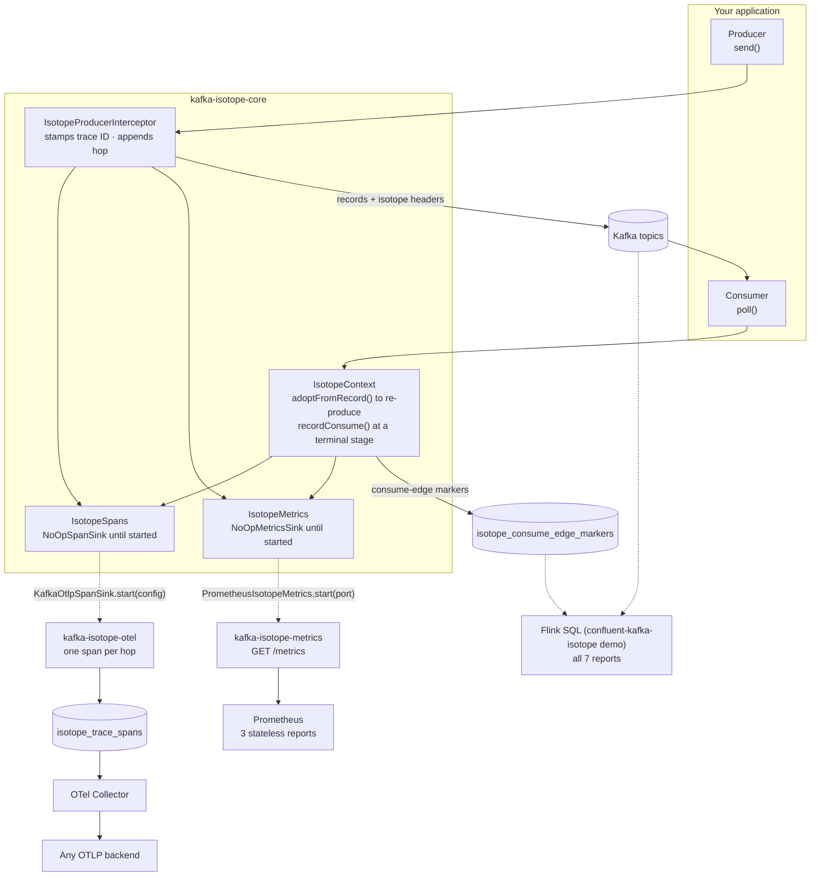

# `kafka-isotope` Library

`kafka-isotope` provides **end-to-end record tracing for Apache Kafka** using Kafka record headers, a `ProducerInterceptor`, and optional Prometheus metrics.

It works by attaching lightweight tracing artifacts—called *isotopes*—to records as they move through Kafka event pipelines.

An isotope is a small tracing payload carried in Kafka record headers. Like a biochemical isotope used to trace molecules through a metabolic pathway, it enables the journey of a record through an event-driven architecture to be observed and analyzed.

On first produce, `kafka-isotope` stamps a UUIDv7 trace ID and origin metadata onto the record. Each subsequent re-produce appends another hop, allowing the full path of a record through Kafka pipelines to be reconstructed.

Built entirely on Kafka’s public extension points—a `ProducerInterceptor` plus record headers—`kafka-isotope` requires:

* No broker changes
* No sidecar agents
* No vendor lock-in

From isotope headers, seven reports can be derived:

* End-to-end latency
* Latency percentiles (p50/p95/p99)
* Pipeline topology
* Bipartite topology (producer → topic → consumer)
* Hop distribution
* Coverage (where traces drop off)
* Stuck trace detection

Three of them (end-to-end latency, pipeline topology and hop distribution) can be exported directly as [Prometheus metrics](https://prometheus.io/docs/concepts/metric_types/) with the `kafka-isotope-metrics` module. All seven run as Flink SQL in the companion [confluent-kafka-isotope](https://github.com/j3-signalroom/confluent-kafka-isotope) demo.

Separately, the optional `kafka-isotope-otel` module emits each hop as an [OpenTelemetry (OTel) span](https://opentelemetry.io/docs/concepts/signals/traces/#spans), so the same traces can be viewed in any [OpenTelemetry Protocol (OTLP)](https://opentelemetry.io/docs/specs/otlp/) backend alongside the rest of your distributed tracing.

This makes `kafka-isotope` a lightweight but powerful observability layer for Kafka-based event-driven architectures.

---

**Table of Contents**
<!-- toc -->
- [**1.0 Modules**](#10-modules)
- [**2.0 Install using Gradle**](#20-install-using-gradle)
- [**3.0 Demo**](#30-demo)
<!-- tocstop -->

---

## **1.0 Modules**

| Module | Coordinate | Pulls | Use it for |
|---|---|---|---|
| [**kafka-isotope-core**](kafka-isotope-core/README.md) | `ai.signalroom:kafka-isotope-core` | Jackson, SLF4J (`kafka-clients` is `compileOnly`) | Trace **propagation** — interceptor, headers, consume markers. |
| [**kafka-isotope-metrics**](kafka-isotope-metrics/README.md) | `ai.signalroom:kafka-isotope-metrics` | kafka-isotope-core + Micrometer/Prometheus | Optional `/metrics` exporter for the stateless reports. |
| [**kafka-isotope-otel**](kafka-isotope-otel/README.md) | `ai.signalroom:kafka-isotope-otel` | kafka-isotope-core + OTLP protobuf | Optional **span** writer — one [OTel span](https://opentelemetry.io/docs/concepts/signals/traces/#spans) per hop on a Kafka topic, read by a stock OpenTelemetry (OTel) Collector. |

`kafka-isotope-core` has no metrics or tracing dependency. It routes every emission through two sinks that start out as no-ops (`NoOpMetricsSink` and `NoOpSpanSink`). Adding `kafka-isotope-metrics` or `kafka-isotope-otel` to the classpath doesn't change that: the real sink is registered only when your application calls `PrometheusIsotopeMetrics.start(port)` or `KafkaOtlpSpanSink.start(config)`, and stays a no-op if that call fails. Until then, each record costs an "_is it enabled?_" check and no metric or span work.



Dashed arrows are optional: the Prometheus metrics and OTEL span modules only run after their `start` call, and Flink SQL lives in the companion demo, not in this library.

## **2.0 Install using Gradle**

```groovy
repositories {
    mavenCentral()
}

dependencies {
    implementation 'ai.signalroom:kafka-isotope-core:0.19.0'
    implementation 'ai.signalroom:kafka-isotope-metrics:0.19.0' // optional — only for Prometheus metrics
    implementation 'ai.signalroom:kafka-isotope-otel:0.19.0'    // optional — only for OTel spans
}
```

## **3.0 Demo**

To showcase the capabilities of the `kafka-isotope` library, the companion [`confluent-kafka-isotope`](https://github.com/j3-signalroom/confluent-kafka-isotope) repository provides a runnable reference e-commerce order event pipeline that can be deployed on Confluent Platform on minikube or Confluent Cloud. Both runtimes support all seven Flink reports and an optional Prometheus + Grafana stack (hosted on minikube) for metrics collection and visualization.